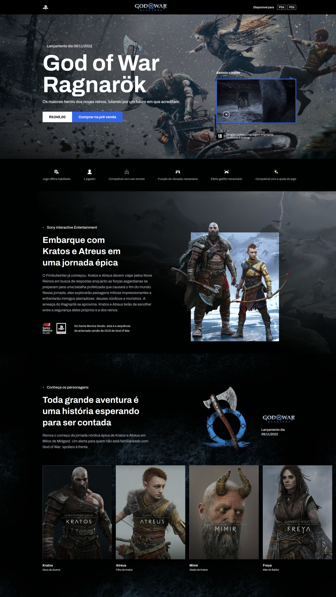

# Página de Venda do Jogo God of War 🎮

Este projeto é uma landing page de venda do jogo God of War, desenvolvida para demonstrar habilidades em estruturação HTML, estilização CSS e utilização do pré-processador Sass. Além disso, a página é totalmente responsiva e foram aplicados conceitos do CSS Flexbox para criar layouts flexíveis. Foram utilizadas animações da biblioteca AOS para adicionar efeitos especiais ao site, bem como a biblioteca Swiper para criar slides utilizando JavaScript.

🔗 Acesse o site: [God of War Landing Page](https://loriprojects-godofwar.netlify.app/)

## 💻 Estruturação HTML

A estrutura HTML da página de venda do God of War foi construída de forma semântica, utilizando tags adequadas para cada elemento do conteúdo. Isso proporciona uma estrutura clara e compreensível, melhorando a acessibilidade e facilitando a manutenção do código.

## 🎨 Estilização CSS e Utilização do Sass

A estilização CSS da página foi cuidadosamente aplicada para criar um design atraente e coerente com a temática do jogo. Além disso, para aumentar a produtividade e modularidade do código CSS, foi utilizado o pré-processador Sass. O Sass permitiu a utilização de recursos avançados, como variáveis, mixins e nesting, simplificando a escrita do código e tornando-o mais eficiente.

## 🌐 Responsividade e Flexbox

A página de venda do God of War é totalmente responsiva, adaptando-se a diferentes dispositivos e tamanhos de tela. A responsividade foi alcançada através do uso de media queries e técnicas de design responsivo.

## 🎉 Animações com AOS e Slider com Swiper

Para adicionar efeitos especiais ao site, foram utilizadas animações da biblioteca AOS. Essas animações proporcionam uma experiência visual mais atraente e interativa para os usuários.

Além disso, a biblioteca Swiper foi utilizada para criar slides dinâmicos e interativos. Com o Swiper, foi possível implementar um carrossel de imagens com transições suaves e recursos de navegação.

